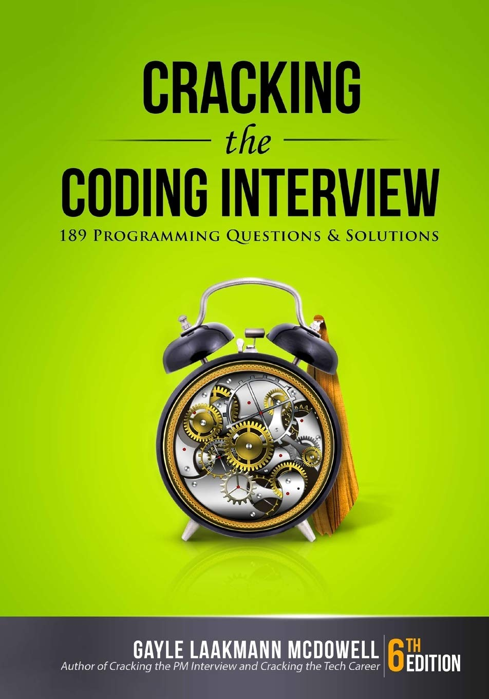

Solutions to the problems in "Cracking the Coding Interview - 189 Programming Questions & Solutions". 

Generally speaking, I would advise against going through this book as it's almost a decade old and out of touch with today's interview standards.  
Almost half of the book covers (very badly) topics such as 'Testing', 'System Design & Scalability' or 'Logic Puzzles', which are a complete waste of time and paper; 
still, the chapters on basic data structures (such as arrays, strings, linked lists, etc.) make up good introductory material.
The chapters on bit manipulation and searching deserve special mention and are the only material I would recommend everyone study.
Dynamic programming is introduced in an intuitive fashion, although I wouldn't rely too heavily on the author's solutions (too much clean code fluff, varying quality of code, and overly complicated code implementations for very simple problems).  
Interestingly, the author has (conveniently) decided to skip the time and space complexity analysis for the majority of the problems, especially the ones of medium and hard difficulty ([doocs](https://doocs.github.io/leetcode/en/) might be a useful resource for that).
